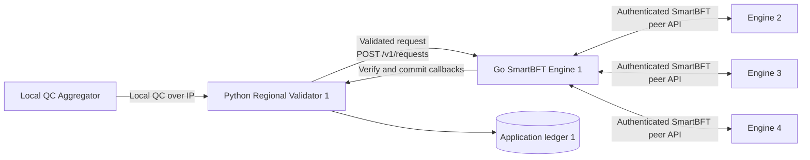

# MWVN SmartBFT Engine Design

## 1. Purpose and boundary

This fork turns the SmartBFT library into a runnable consensus-engine service for
the MWVN regional layer. The new Go application is `cmd/mwvn_bftnode`.

It is important to separate the responsibilities:

| Component | Responsibility |
|---|---|
| MWVN Regional Validator (Python, separate repository) | Receive a local QC, decode and validate it, apply expiry/replay/policy/state-machine rules, expose application status, and own the durable regional ledger. |
| `mwvn_bftnode` (Go, this repository) | Order requests already admitted by the Python validator, exchange authenticated SmartBFT messages with other engines, verify validator decision signatures, and return committed decisions to the paired validator. |
| SmartBFT library (Go, this repository) | Run the PBFT-family consensus protocol, including proposal, PREPARE, COMMIT, view change, batching, and write-ahead logging. |
| Regional deployment (separate repository) | Configure and run four Python validators and four paired Go engines, their membership, keys, containers, and end-to-end tests. |

The simulator and Local QC Aggregator call the Python Regional Validator. They do
not call a Go consensus engine directly. The Go application is not a complete
MWVN validator and does not know the witness-event or local-QC policy.



Each Regional Validator knows only its paired engine URL. Each Go engine knows
all Go peers from the shared membership file and knows only its paired Python
validator callback URL.

## 2. Upstream SmartBFT v1.0.1 structure

Before the MWVN changes, the upstream tag `v1.0.1` had this top-level structure:

```text
SmartBFT/
├── .github/                 CI and repository automation
├── examples/
│   └── naive_chain/         Example embedding of the SmartBFT library
├── internal/
│   └── bft/                 Internal consensus protocol implementation
├── pkg/
│   ├── api/                 Dependency interfaces and metrics
│   ├── consensus/           Public consensus facade
│   ├── metrics/             Metrics providers
│   ├── types/               Public configuration and protocol types
│   └── wal/                 Write-ahead-log implementation
├── scripts/                 Upstream development scripts
├── smartbftprotos/          Consensus protocol protobuf definitions
├── test/                    Multi-node protocol and reconfiguration tests
├── vendor/                  Vendored Go dependencies
├── go.mod
├── go.sum
├── LICENSE
└── README.md
```

Upstream SmartBFT is a Go library. It defines the consensus algorithm and the
interfaces an embedding application must supply, but it does not provide an
MWVN-aware HTTP server, an MWVN membership file, or a Python validator.

## 3. Structure after the MWVN changes

The original directories remain. The fork adds a runnable adapter, documentation,
tests, and the configurable PREPARE deadline:

```text
SmartBFT/
├── cmd/
│   └── mwvn_bftnode/                 NEW: runnable Go consensus-engine adapter
│       ├── main.go                   process flags, startup and shutdown
│       ├── config.go                 membership, key loading and canonical data
│       ├── node.go                   SmartBFT interfaces, proposals and delivery
│       ├── transport.go              authenticated HTTP peer transport and trace
│       ├── callback.go               Go-to-Python validation/commit client
│       ├── server.go                 public and peer HTTP routes
│       ├── config_test.go            membership/configuration tests
│       └── Dockerfile                engine container image
├── docs/
│   ├── DESIGN.md                     NEW: consolidated design and API document
│   └── INSTALLATION.md               NEW: standalone build and test instructions
├── internal/bft/
│   ├── view.go                       CHANGED: PREPARE deadline behavior
│   ├── util.go                       CHANGED: pass deadline into a view
│   └── prepare_timeout_test.go       NEW: focused timeout tests
├── pkg/
│   ├── consensus/consensus.go        CHANGED: propagate the setting
│   └── types/
│       ├── config.go                 CHANGED: public setting and validation
│       └── config_test.go            NEW: default and validation tests
├── test/
│   ├── prepare_timeout_test.go       NEW: four-node behavior tests
│   ├── reconfig.go                   CHANGED: retain setting on reconfiguration
│   └── test_app.go                   CHANGED: configure the default in tests
├── scripts/install-go.sh             NEW: local Go installation helper
├── Makefile                          NEW: focused MWVN test targets
└── README.md                         CHANGED: points to MWVN documentation
```

Deployment-only files are deliberately absent. The four-node Compose file,
membership, development keys, and cross-repository end-to-end test live in
`mwvn-regional-deployment`. The full MWVN validation/state-machine code lives in
`mwvn-validator`.

## 4. The application added to use SmartBFT

### 4.1 Why an adapter was needed

SmartBFT is embedded through Go interfaces; it is not an HTTP service by itself.
`mwvn_bftnode` supplies the interfaces and process plumbing needed to operate one
independent engine:

- `Comm`: send consensus messages and forwarded transactions to known peers;
- `Signer`: sign proposals and view data with the node's Ed25519 identity;
- `Verifier`: delegate application/QC validation to the paired Python validator
  and verify SmartBFT validator signatures;
- `Assembler`: build a deterministic proposal from admitted requests;
- `Application`: deliver a committed proposal to the paired Python validator;
- `Synchronizer`: expose limited in-process state required by SmartBFT;
- `WAL`: persist SmartBFT protocol state.

The adapter starts one `consensus.Consensus` instance per process. A four-node
deployment therefore runs four Go processes and four paired Python processes.
For `n = 4`, SmartBFT tolerates `f = 1` Byzantine validator and decides with a
quorum of `2f + 1 = 3`.

### 4.2 Request and decision flow

```mermaid
sequenceDiagram
    participant C as Aggregator / Client
    participant V as Python Validator
    participant E as Paired Go Engine
    participant P as Other Go Engines
    participant L as Python Ledger

    C->>V: Submit local QC
    V->>V: MWVN validation and state-machine checks
    V->>E: POST /v1/requests
    E->>V: POST /internal/v1/requests/verify
    V-->>E: deterministic request_id
    E->>P: PRE-PREPARE / PREPARE
    Note over E,P: Continue immediately at PREPARE quorum;<br/>abort and change view if the deadline expires first
    E->>P: COMMIT
    P-->>E: matching COMMIT votes
    E->>E: verify decision signatures
    E->>V: POST /internal/v1/proposals/verify
    V-->>E: ordered request_ids
    E->>V: POST /internal/v1/commits
    V->>L: durable application-ledger append
    V-->>E: HTTP 2xx
```

An HTTP `202` from `/v1/requests` means only that SmartBFT accepted the request
for processing. It is not proof of commitment. The client reads final state from
the Python validator API.

### 4.3 Membership and transport

At startup, `config.go` loads a strict JSON membership document containing:

- a network ID and membership version;
- exactly four validator IDs;
- each engine's HTTP peer URL;
- each engine's Ed25519 public key.

`transport.go` sends protobuf SmartBFT messages and JSON forwarded requests over
HTTP. Every peer request carries the network ID, sender ID, and an Ed25519
signature covering the protocol domain, network ID, path, and exact body bytes.
This is suitable for an isolated experiment; production deployment still needs
TLS/mTLS, authorization, replay protection, secret management, and recovery.

## 5. Five-minute PREPARE vote buffer change

### 5.1 Exact semantics

The fork adds this public configuration field:

```go
PrepareVoteCollectionTimeout time.Duration
```

Its default is `5 * time.Minute`. It is a maximum deadline while a replica is
collecting matching PREPARE votes, not a mandatory five-minute sleep and not a
rolling batch window.

```text
Enter PREPARE collection
        |
        +-- required matching PREPARE votes arrive before deadline
        |       -> stop timer -> send COMMIT immediately
        |
        +-- deadline expires first
                -> complain about current view
                -> abort current view
                -> use SmartBFT's existing view-change recovery path
```

The deadline does not apply to COMMIT collection. It does not change quorum
calculation, request batching, heartbeats, signatures, message formats, or the
existing view-change safety rules.

### 5.2 Code path

| File | Change |
|---|---|
| `pkg/types/config.go` | Defines the field, sets the five-minute default, and rejects zero/negative public configuration values. |
| `pkg/consensus/consensus.go` | Copies the public setting into internal protocol parameters. |
| `internal/bft/util.go` | Propagates the setting when constructing a view. |
| `internal/bft/view.go` | Starts the timer in `processPrepares`; quorum stops the timer and proceeds, expiry complains and aborts. |
| `cmd/mwvn_bftnode/main.go` | Exposes `-prepare-timeout`, default `5m`. |
| `cmd/mwvn_bftnode/node.go` | Assigns the command-line value to the SmartBFT configuration. |

Configuration example:

```bash
mwvn_bftnode \
  -id 1 \
  -listen :8200 \
  -membership /config/membership.json \
  -private-key /run/secrets/node-1.key \
  -core-url http://regional-validator-1:8080 \
  -data-dir /data \
  -prepare-timeout 5m
```

Tests use short deadlines so failure/recovery scenarios finish quickly. The
normal four-node test retains the real `5m` configuration and proves consensus
completes as soon as quorum is available rather than waiting five minutes. The
relevant tests are `internal/bft/prepare_timeout_test.go`,
`test/prepare_timeout_test.go`, and `pkg/types/config_test.go`.

## 6. HTTP API summary

This section consolidates the engine's HTTP surface in the design document.
Implementation routes are defined in `cmd/mwvn_bftnode/server.go`; callbacks are
defined in `cmd/mwvn_bftnode/callback.go`.

### 6.1 Python validator to Go engine

| Method | Path | Purpose | Success |
|---|---|---|---|
| `GET` | `/v1/health` | Engine readiness and node ID. | `200`; `503` while starting |
| `GET` | `/v1/status` | Node-local leader, membership, paired-ledger state, and PREPARE deadline. | `200` |
| `POST` | `/v1/requests` | Submit one request already admitted by the Python validator. | `202 pending` |
| `GET` | `/v1/trace?after=0&limit=500` | Read bounded node-local protocol trace events. | `200` |

Minimal submission example:

```http
POST /v1/requests
Content-Type: application/json

{
  "schema_version": "mwvn-approved-qc/v2",
  "request_id": "request-001",
  "qc_id": "qc-001",
  "claim_hash": "7a9e667f3b8d94b7c0c5f590a8a2c26d662f8e86d73e631cdd8c39f24f40a9b4"
}
```

```json
{
  "state": "pending",
  "request_id": "request-001",
  "node_id": 1
}
```

### 6.2 Go engine to its paired Python validator

| Method | Path | Purpose |
|---|---|---|
| `GET` | `/internal/v1/state` | Read paired node ID, application-ledger height, and head hash. |
| `POST` | `/internal/v1/requests/verify` | Deterministically validate one submitted request and return its ID. |
| `POST` | `/internal/v1/proposals/verify` | Validate proposal contents and application-ledger linkage. |
| `POST` | `/internal/v1/commits` | Deliver the decided record and verified SmartBFT decision proof for durable storage. |

These callback endpoints are implemented by `mwvn-validator`, not by this Go
repository.

### 6.3 Go engine peer API

| Method | Path | Body | Purpose |
|---|---|---|---|
| `POST` | `/internal/v1/consensus` | SmartBFT protobuf | Deliver PRE-PREPARE, PREPARE, COMMIT, view-change, heartbeat, and state-transfer protocol messages. |
| `POST` | `/internal/v1/transaction` | JSON application request | Forward a request to the current leader. |

Both routes require `X-MWVN-Network`, `X-MWVN-Sender`, and
`X-MWVN-Signature`. They are private engine-to-engine routes; neither the
simulator nor the Python validator should call them.

## 7. Persistence and current limitations

The Go engine persists SmartBFT protocol data in its WAL. The Python validator
persists the application ledger. The common application record hash excludes a
node-local decision-proof subset because two honest nodes can hold different
valid 3-of-4 signature subsets for the same decision.

Current limitations are intentional and must remain visible:

- restart from a non-empty SmartBFT WAL/application ledger is not implemented;
- state transfer is not integrated into the application ledger;
- Python-to-Go and Go-to-Python HTTP calls are not authenticated;
- peer HTTP is signed but not encrypted and has no replay protection;
- keys in the deployment repository are development-only;
- the engine orders admitted opaque requests; it does not implement MWVN QC
  validation or the MWVN conflict-preserving state machine.

## 8. Repository relationships

```text
mwvn-local-aggregator
    -> sends local QCs to mwvn-validator

mwvn-validator
    -> owns MWVN rules and the application ledger
    -> calls one SmartBFT engine through this repository's API

SmartBFT (this repository)
    -> owns the consensus protocol and mwvn_bftnode adapter

mwvn-regional-deployment
    -> assembles four mwvn-validator instances and four SmartBFT engines
```

Keeping these boundaries allows the PBFT-family engine to be replaced later
without moving MWVN validation policy into the consensus library.
