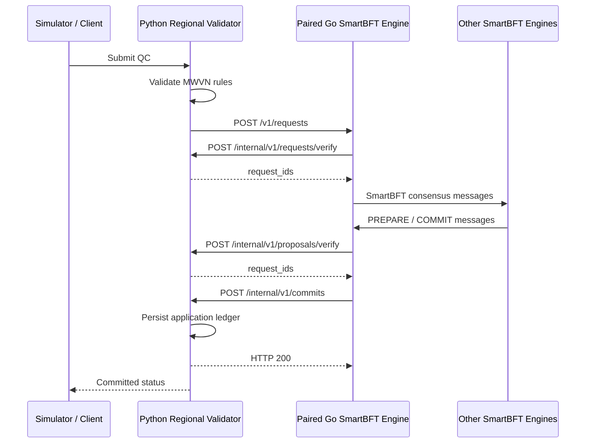

# MWVN Regional Validator ↔ SmartBFT Engine API

Status: implemented local-development contract  
API version: `v1`  
SmartBFT repository: `/Users/shlomy/projects/SmartBFT-v1.0.1`  
Go command: `cmd/mwvn_bftnode`

## 1. Purpose

This document defines the HTTP boundary between one MWVN Regional Validator process, implemented in Python, and its one paired SmartBFT consensus-engine process, implemented in Go.

```text
MWVN Regional Validator 1 (Python) ↔ SmartBFT Engine 1 (Go)
MWVN Regional Validator 2 (Python) ↔ SmartBFT Engine 2 (Go)
MWVN Regional Validator 3 (Python) ↔ SmartBFT Engine 3 (Go)
MWVN Regional Validator 4 (Python) ↔ SmartBFT Engine 4 (Go)
```

The Python service owns MWVN rules, QC validation, application state and the application ledger. The Go service owns consensus, validator membership, validator signatures, peer communication and the SmartBFT write-ahead log.

The simulator calls the Python service. It must not submit directly to the Go engine.

## 2. Interaction overview



HTTP acceptance by the Go engine means only that the request entered SmartBFT. It does not mean the request committed.

## 3. Pair configuration

The Python process stores the URL of only its paired engine:

```text
MWVN_BFT_URL=http://bft-node-1:8200
```

The Go engine stores the URL of only its paired Python core:

```text
-core-url http://regional-validator-1:8080
```

The Go engines learn the other engine addresses and public keys from their shared membership file. The Python process does not send SmartBFT peer messages.

## 4. Python → Go engine API

### 4.1 Health

```http
GET /v1/health
```

Successful response, HTTP `200`:

```json
{
  "status": "ok",
  "node_id": 1
}
```

While the engine is starting, it returns HTTP `503` with `status: "starting"`.

### 4.2 Engine and paired-ledger status

```http
GET /v1/status
```

Successful response, HTTP `200`:

```json
{
  "status": "ok",
  "node_id": 1,
  "leader_id": 1,
  "membership_version": 1,
  "network_id": "mwvn-local-four-node-v1",
  "peer_count": 4,
  "ledger_height": 3,
  "ledger_head": "64-character-hexadecimal-hash",
  "prepare_vote_timeout_seconds": 300,
  "process_model": "one independent SmartBFT consensus-engine process"
}
```

The ledger fields come from the paired Python process. If that process cannot be queried, the engine returns HTTP `502`.

This endpoint is node-local diagnostic information. A response from one node does not prove that it is the latest cluster state.

### 4.3 Submit a validated application request

```http
POST /v1/requests
Content-Type: application/json
```

Maximum body size: 64 KiB.

The body is an application request owned by the Python MWVN project. The engine requires a stable, non-empty `request_id`; all other MWVN fields are interpreted by Python through the verification callbacks.

Current development fixture example:

```json
{
  "schema_version": "mwvn-approved-qc/v1",
  "request_id": "request-001",
  "qc_id": "qc-001",
  "claim_hash": "7a9e667f3b8d94b7c0c5f590a8a2c26d662f8e86d73e631cdd8c39f24f40a9b4",
  "window_start": "2026-09-10T07:00:00Z",
  "window_end": "2026-09-10T07:05:00Z",
  "region": "med-east-demo",
  "classification": "AUTHENTIC",
  "policy_version": "demo-policy-v1",
  "evidence_refs": ["synthetic-vdes-event-001"],
  "conflict_links": []
}
```

The new Python repository may replace this fixture schema with the frozen real QC schema. The Go engine should remain unaware of MWVN-specific fields other than the stable request identity.

Accepted response, HTTP `202`:

```json
{
  "state": "pending",
  "request_id": "request-001",
  "node_id": 1
}
```

Possible errors:

| Status | Meaning |
|---|---|
| `400` | Empty request or body larger than 64 KiB. |
| `405` | Unsupported HTTP method. |
| `422` | The paired Python validator rejected the request. |
| `503` | SmartBFT could not accept the request. |

The caller must query application status from the Python API. The Go endpoint currently has no request-status endpoint.

### 4.4 Read protocol trace

```http
GET /v1/trace?after=0&limit=500
```

Parameters:

- `after`: return events whose node-local index is greater than this value; default `0`.
- `limit`: number of events, from `1` to `2000`; default `500`.

Response, HTTP `200`:

```json
{
  "events": [
    {
      "index": 12,
      "timestamp": "2026-09-11T09:10:11.123Z",
      "node_id": 1,
      "direction": "send",
      "sender": 1,
      "receiver": 2,
      "message_type": "PREPARE",
      "view": 0,
      "sequence": 1,
      "proposal_digest": "64-character-hexadecimal-hash",
      "size_bytes": 124,
      "outcome": "queued_http"
    }
  ]
}
```

Known message types include `PRE-PREPARE`, `PREPARE`, `COMMIT`, `VIEW-CHANGE`, `VIEW-DATA`, `NEW-VIEW`, `HEARTBEAT`, `HEARTBEAT-RESPONSE`, `STATE-TRANSFER-REQUEST`, `STATE-TRANSFER-RESPONSE`, `FORWARDED-REQUEST` and `LEDGER-APPEND`.

The trace is bounded in memory and is diagnostic data, not a durable audit log.

## 5. Go engine → Python callback API

The new Python repository must implement these four endpoints on every Regional Validator instance.

### 5.1 Read application state

```http
GET /internal/v1/state
```

Response, HTTP `200`:

```json
{
  "node_id": 1,
  "height": 0,
  "ledger_head": "0000000000000000000000000000000000000000000000000000000000000000"
}
```

Rules:

- `node_id` must equal the paired Go engine ID.
- `height` is the number of durably committed application records.
- `ledger_head` is the latest application-record hash, or 64 zeroes for an empty ledger.
- The current engine refuses to start when `height` is non-zero because restart/state transfer has not yet been implemented.

### 5.2 Verify one submitted request

```http
POST /internal/v1/requests/verify
Content-Type: application/json
```

The body is exactly the application request submitted to `POST /v1/requests`.

Successful response, HTTP `200`:

```json
{
  "request_ids": ["request-001"]
}
```

The response must contain exactly one non-empty request ID. Any non-2xx response causes the engine to reject external admission with HTTP `422`.

The Python implementation should perform deterministic validation. The same request must produce the same result at every honest validator.

### 5.3 Verify a proposed batch

```http
POST /internal/v1/proposals/verify
Content-Type: application/json
```

Request:

```json
{
  "header": {
    "schema_version": "mwvn-smartbft-proposal/v1",
    "sequence": 1,
    "previous_hash": "0000000000000000000000000000000000000000000000000000000000000000",
    "data_hash": "64-character-hexadecimal-hash"
  },
  "approved_qcs": [
    {
      "request_id": "request-001"
    }
  ]
}
```

`approved_qcs` contains the complete application request objects; the abbreviated object above only illustrates their position.

Successful response, HTTP `200`:

```json
{
  "request_ids": ["request-001"]
}
```

Rules:

- Return one request ID for every request, in the same order.
- Reject an empty batch.
- Validate every QC independently.
- Verify that `sequence` is the next application-ledger sequence.
- Verify that `previous_hash` equals the local application-ledger head.
- The Go engine verifies `schema_version`, `data_hash` and SmartBFT metadata before invoking this callback.
- Current engine configuration creates batches containing one request, although the contract uses an array.

### 5.4 Deliver a committed decision

```http
POST /internal/v1/commits
Content-Type: application/json
```

Request:

```json
{
  "schema_version": "mwvn-bft-commit/v1",
  "node_id": 1,
  "sequence": 1,
  "view": 0,
  "previous_hash": "0000000000000000000000000000000000000000000000000000000000000000",
  "proposal_digest": "64-character-hexadecimal-hash",
  "approved_qcs": [
    {
      "request_id": "request-001"
    }
  ],
  "decision_proof": [
    {
      "validator_id": 1,
      "value": "base64-ed25519-signature",
      "auxiliary": "base64-smartbft-auxiliary-data"
    },
    {
      "validator_id": 2,
      "value": "base64-ed25519-signature",
      "auxiliary": "base64-smartbft-auxiliary-data"
    },
    {
      "validator_id": 3,
      "value": "base64-ed25519-signature",
      "auxiliary": "base64-smartbft-auxiliary-data"
    }
  ]
}
```

Before making this callback, the Go engine checks that the proof contains at least the SmartBFT quorum and verifies every included validator signature against membership.

The Python service must:

1. verify the callback schema and paired `node_id`;
2. validate every contained application request again;
3. reject duplicate validator IDs or an insufficient proof;
4. verify `sequence` and `previous_hash` against its local ledger;
5. handle an identical repeated delivery idempotently;
6. durably persist the application record before returning HTTP `200`.

Example successful response:

```json
{
  "created": true,
  "record": {
    "sequence": 1,
    "record_hash": "64-character-hexadecimal-hash"
  }
}
```

The engine ignores the response body but requires a 2xx response. A rejection is treated as a fatal application/consensus integration error in the current implementation.

## 6. Ledger-hash rule

Different honest SmartBFT engines may complete the same decision using different valid quorum subsets. For example:

```text
Engine 1 proof: validators 1, 2, 3
Engine 2 proof: validators 1, 2, 4
```

Both proofs are valid for a four-node cluster, but they are not byte-identical. Therefore the shared application `record_hash` must cover only consensus-decided data:

```json
{
  "schema_version": "mwvn-regional-ledger/v1",
  "sequence": 1,
  "view": 0,
  "previous_hash": "...",
  "proposal_digest": "...",
  "approved_qcs": []
}
```

Do not include these node-local fields in `record_hash`:

- `decision_proof`;
- `committed_at`;
- local node ID;
- local logging or transport metadata.

Store the decision proof alongside the record and verify it independently. The signatures make the proof verifiable even though it is excluded from the common record hash.

## 7. Engine peer API — not called by Python

The following endpoints are reserved for Go-engine communication:

```http
POST /internal/v1/consensus
Content-Type: application/x-protobuf

POST /internal/v1/transaction
Content-Type: application/json
```

Required headers:

```text
X-MWVN-Network: <membership network_id>
X-MWVN-Sender: <validator ID>
X-MWVN-Signature: <base64 Ed25519 signature>
```

The signed payload covers the protocol domain, network ID, request path and exact body bytes using length-delimited fields. Unknown validators, the wrong network ID and invalid signatures receive HTTP `401`.

The Python repository must not implement or call these endpoints.

## 8. Error format

Go engine errors use:

```json
{
  "error": "human-readable explanation"
}
```

Python callbacks should use the same structure for non-2xx responses. Validation failures should return HTTP `422`; application-state conflicts should return HTTP `409`; temporary dependency failures may return HTTP `502` or `503`.

The engine currently treats any non-2xx callback response as failure and includes the returned body in its local error message.

## 9. Timeouts and limits

| Operation | Current value |
|---|---:|
| Go → Python callback timeout | 5 seconds |
| Go peer HTTP timeout | 3 seconds |
| External submission maximum | 64 KiB |
| Consensus-message maximum | 2 MiB |
| Trace retained per engine | Latest 5,000 events |
| PREPARE vote collection maximum | 5 minutes |
| SmartBFT request batch count | 1 |
| SmartBFT request batch interval | 25 ms |

The five-minute value is a PREPARE-vote deadline. Consensus continues immediately when the required votes arrive; it is not a mandatory five-minute delay.

## 10. Security status

Implemented now:

- explicit four-node membership;
- distinct Ed25519 engine identities;
- signed and authenticated Go-engine peer requests;
- validation of decision-proof signatures inside the Go engine;
- body-size limits and strict membership parsing.

Local-development limitations:

- Python ↔ Go calls are not authenticated;
- HTTP traffic is not protected by TLS;
- the public submission endpoint has no client authentication;
- peer-request replay protection is not implemented;
- included development private keys are public test material;
- full restart and state transfer are not implemented.

Before running outside an isolated development network, add mTLS or equivalent mutual service authentication, authorization, transport replay protection, production secret management and verified recovery.

## 11. Migration checklist for the new Python repository

The new MWVN Regional Validator repository should:

1. implement the four callbacks in Section 5;
2. preserve deterministic validation across all validators;
3. configure exactly one paired engine URL per validator instance;
4. submit to `/v1/requests` only after ingress validation succeeds;
5. persist commits before acknowledging the callback;
6. calculate the ledger hash according to Section 6;
7. expose its own public QC submission and status API to the simulator;
8. keep Go peer endpoints private and inaccessible to the simulator;
9. add authentication between the two services before non-local deployment;
10. add contract tests that run the Python implementation against the real Go engine.

## 12. Current implementation references

- Go HTTP routes: `cmd/mwvn_bftnode/server.go`
- Go → Python client: `cmd/mwvn_bftnode/callback.go`
- SmartBFT adapter and commit schema: `cmd/mwvn_bftnode/node.go`
- Membership and canonical encoding: `cmd/mwvn_bftnode/config.go`
- Authenticated peer transport: `cmd/mwvn_bftnode/transport.go`
- Local deployment: `deploy/local/compose.yaml`

This contract documents the current local implementation. It is not a claim of production readiness or full MWVN validation.
